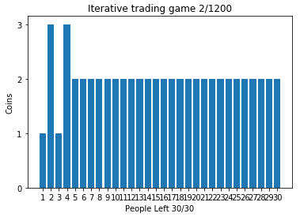
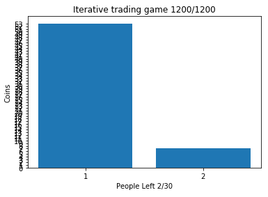

# Iterative trading game

After learning about the final inevitable conclusion of the iterative trading game from:    
https://www.youtube.com/watch?v=1Lz-yhjh1kw

I decided to test this assumption in practice with [Python](https://www.python.org/) in [Jupyter Notebook](http://jupyter.org/).  

Unfortunately, the assumption is correct.  

You can see it in the action at:  

To run on a local machine:

<pre>
pipenv install jupyterlab
pipenv install numpy
pipenv install matplotlib

pipenv run jupyter lab
</pre>

**WARNING !!!**  
Code quality can be improved, do not use it for learning the best code quality practice.   
Sometimes there is no cost/benefit in improving code quality of simple scripts.